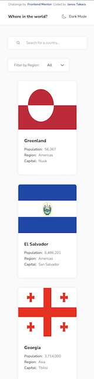

# Frontend Mentor - REST Countries API with color theme switcher solution

This is a solution to the [REST Countries API with color theme switcher challenge on Frontend Mentor](https://www.frontendmentor.io/challenges/rest-countries-api-with-color-theme-switcher-5cacc469fec04111f7b848ca). Frontend Mentor challenges help you improve your coding skills by building realistic projects.

## Table of contents

-   [Overview](#overview)
    -   [The challenge](#the-challenge)
    -   [Screenshot](#screenshot)
    -   [Links](#links)
-   [My process](#my-process)
    -   [Built with](#built-with)
    -   [Continued development](#continued-development)
    -   [Useful resources](#useful-resources)
-   [Author](#author)

## Overview

### The challenge

Users should be able to:

-   See all countries from the API on the homepage
-   Search for a country using an `input` field
-   Filter countries by region
-   Click on a country to see more detailed information on a separate page
-   Click through to the border countries on the detail page
-   Toggle the color scheme between light and dark mode _(optional)_

### Screenshot

 

### Links

-   Solution URL: [source code on GitHub](https://github.com/JT1974/rest-countries)
-   Live Site URL: [you can try it here](https://jt1974.github.io/rest-countries/)

## My process

### Built with

-   Semantic HTML5 markup
-   CSS custom properties
-   Flexbox
-   CSS Grid
-   Mobile-first workflow
-   [React](https://reactjs.org/) - JS library
-   [Styled Components](https://styled-components.com/) - For styles

### Continued development

I'm still not comfortable with Styled Components and more specifically prop passing (e.g. background-image src prop for a div), avoiding warnings about having multiple components with the same id (using the attrs() method of Styled Components).

I found a good article from [Talia Marcassa - Styled Components: To Use or Not to Use?](https://medium.com/building-crowdriff/styled-components-to-use-or-not-to-use-a6bb4a7ffc21)

She also wrote about Styled Components' ThemeProvider and testing the styling of components with Jest, which topics also sound very interesting and I'm planning to look into these a bit later.

### Useful resources

-   [Styled Componentns FAQ](https://styled-components.com/docs/faqs#when-to-use-attrs) - I've been wrestling with Styled Components in my latest projects with more, or less success, however I still could not get a grip on passing props to styled components. The doc is very useful in general, but I still haven't found the solution for the issueI described above.
-   [Talia Marcassa - Styled Components: To Use or Not to Use?](https://medium.com/building-crowdriff/styled-components-to-use-or-not-to-use-a6bb4a7ffc21) - This is a really good article that I found during the debugging of the above issue. It's worth reading.

## Author

-   Website - [Janos Takacs](https://github.com/JT1974)
-   Frontend Mentor - [@JT1974](https://www.frontendmentor.io/profile/JT1974)
-   Twitter - [@TakacsJanos7](https://twitter.com/TakacsJanos7)

